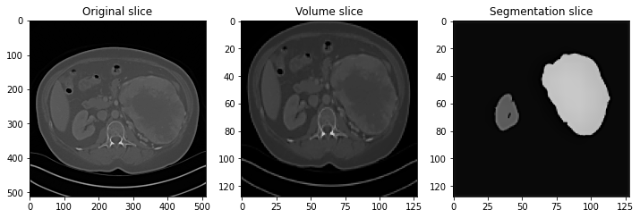

# Kidney Tumor Segmentation

Semantic segmentation is a critical task in medical imaging that involves classifying each pixel in an image into a specific category. One such application is the segmentation of kidney and tumor regions from CT scan images. In this regard, the U-Net architecture has proven to be highly effective, achieving excellent results in medical imaging segmentation. 
The objective of this project is to explore kidney and kidney tumor semantic segmentation techniques. For this purpose, it was acquired the dataset consisting of the ground truth semantic segmentations for arterial phase abdominal CT scans of 210 distinct kidney cancer patients, released for model training and validation within the KiTS19 Challenge.

## Case Selection:

In order to reduce the dimension of the dataset, 48 of the 210 cases were selected based on their size and Hounsfield Units range. In particular, cases with the following characteristics were selected:
- Number of slices not greater than 110.
- Hounsfield Units range between -1024 and 1679.

## Data Preprocessing:

CT scan data initially in Nifty format were preprocessed using the MONAI framework.
- The *LoadImaged* function is used to load the image and its corresponding segmentation, which are stored as separate files in the dataset. 
- The *CropForegroundd* function is then used to crop the foreground region of the image and segmentation, discarding the background region. 
- The *ScaleIntensityRanged* function is used to rescale the intensity values of the image initially ranging between -1024 and 1679, and map them to the new      range 0 to 1. In this case, the intensity values of the image are rescaled twice: first to the range [-79, 304] to target the region of kidney, and kidney    tumor then to the range [0, 1] to normalize them.
- The *AdjustContrastd* function is used to adjust the contrast of the image using a gamma correction parameter of 1.5.
- The *Resized* function is used to resize both the image and its corresponding segmentation to a spatial size of 256x256, to make them all of the same size.
- Finally, the *ToTensord* function is used to convert the image and segmentation to PyTorch tensors.
  
The preprocessed volumes are then converted to a 2D format by saving each vertical slice (axis x) as a png picture.

## Training:

For the project it is employed a standard 2D U-Net architecture, which consists of a series of convolutional and pooling layers, to learn features from the images. The U-Net architecture is unique in that it uses skip connections between the encoder and decoder, which enables it to retain more detailed information during the downsampling process.
The model uses the ReLu activation function, the Adam optimizer, the categorical cross-entropy loss function and, to evaluate the model's performance, the mean intersection over union (IoU) metric. Moreover, for the output, a softmax activation function is used.
The main training is performed on a dataset of 2500 training images with a batch size of 50 and 1100 validation images with a batch size of 22 for 5 epochs each consisting of 50 steps. 

## Results:

After training, the mean IoU value is 0.989 on the validation dataset.

 

This accuracy value though, does not seem to be reflected in the predicted segmentation. 

This could be due to a number of reasons: implementation of the network, choice of hyperparameters for the architecture, etc. To give a definitive answer, a thorough study with extensive hyperparameter optimization for each of the architectures is warranted.

In conclusion, kidney and kidney tumor segmentation from CT scan images has the potential for use in clinical practice to assist with kidney disease diagnosis and treatment and is a challenging task that requires meticulous preprocessing of the data and adequate training of a U-Net model. This particular project approach might need to take further steps in order to achieve-state-of-the art results.
Future work should be directed towards more extensively evaluating potential differences between the ’plain’ U-Net and its architectural variants.
